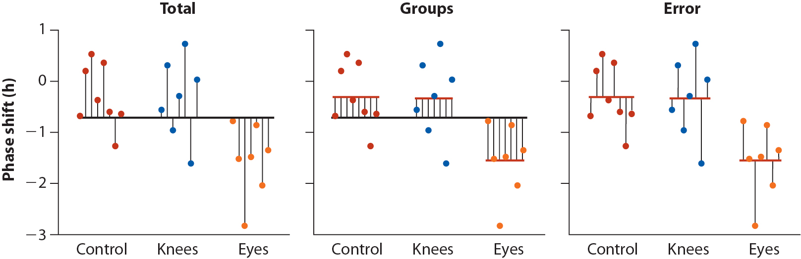

# Analysis of Variance

$t$-tests are the standard approach for comparing means between two groups.  When you want to compare means between more than two groups a technique called "Analysis of Variance" (ANOVA) is used.

## Hypotheses for ANOVA

When using ANOVA to compare means, the null and alternative hypotheses are:

* $H_0$: The means of all the groups are equal
* $H_A$: At least one of the means is different from the others

## ANOVA, assumptions

ANOVA assumes:

* The measurements in every group represent a random sample from the corresponding population
* The varaible of interest is normally distributed
* The variance is approximately the same in all the groups

## ANOVA, key idea

The key idea behind ANOVA is that:

* If the observations in each group are drawn from populations with equal means (and variances) then the variation _between_ group means should be similar to the inter-individual variation _within groups_.


## Partioning of sum of squares

Another way to think about ANOVA is as a "partitioning of variance".  The total variance among all the individuals across groups can be decomposed into: 

  1) variance of the group means around the "grand mean"; 
  
  2) variance of individuals around the group means.  

However, rather than using variance we use sums of square deviations around the respectives means (usually shortened to "sums of squares"). 

This decomposition is represented visually in the figure below:

```{r, echo = FALSE, out.width = "700px", fig.align = "center", fig.cap = "Whitock & Schluter, Fig 15.1.2 -- Illustrating the partitioning of sum of squares into $MS_{group}$ and $MS_{error}$ components. ", eval = TRUE, results = "show"}

```

## Mathematical partitioning of sums of squares

Variable $X$ with a total sample of $N$  observations, partitioned ito $k$ groups.  The sample size of the g-th group is $n_g$, and thus $N = \sum_{g=1}^{k} n_g$.  Let $\overline{X}$ indicate the grand mean of $X$ and $\overline{X}_g$ indicate the mean of $X$ in the g-th group. 

**Total sums of squares**

We call the sum of the squared deviations around the grand mean the "total sum of sqaures" ($SS_\text{total}$).

\[
SS_\text{total} = \sum_{i=1}^N (x_i-\overline{X})^2
\]

- The total degrees of freedom is: $df_\text{total} = N - 1$


**Group sum of squares and group mean square deviation**

The sum of squared deviations of the group means around the grand mean is called the "group sum of squares":
\[
SS_\text{group} = \sum_{g=1}^kn_g(\overline{X}_g - \overline{X})^2
\]

- The degrees of freedom associated with the group sum of squares is: $df_\text{group} = k - 1$

- Define the "group mean squared deviation" as:
\[
MS_\text{group} = \frac{SS_\text{group}}{k-1}
\]

**Error sum of squares and error mean square deviation**

The sum of squared deviations of the individual observations about their respective group means is called the "error sum of squares":
\[
SS_\text{error} = \sum_{g=1}^k\sum_{i=1}^{n_g} (x_{i,g} - \overline{X}_g)^2
\]

- The degrees of freedom associated with the error sum of squares is: $df_\text{error} = N - k$

- Define the "error mean squared deviation" as:
\[
MS_\text{error} = \frac{SS_\text{error}}{N-k}
\]

## ANOVA table

The results of an analysis of variance test are often presented in the form of a table organized as follows:

|Source | $SS$ | $df$ | $MS$ | $F$  |
|:------|:----:|:----:|:----:|:----:|
| Group |$SS_\text{group}$|$k-1$|$MS_\text{group}$|$MS_\text{group}/MS_\text{error}$|
| Error |$SS_\text{error}$|$N-k$|$MS_\text{error}$|      |
| Total |$SS_\text{total}$|$N-1$|$MS_\text{total}$|      |


## ANOVA test statistic, $F$

* The test statistic used in ANOVA is designated $F$, and is based on the ratio of the group mean square deviation ($MS_\text{groups}$) to the error mean square deviation" ($MS_\text{error}$):

\[
F = \frac{\text{group mean square}}{\text{error mean square}} = \frac{\text{MS}_\text{group}}{\text{MS}_\text{error}}
\]

* Under the null hypothesis, the between group and within group variances are similar and thus the $F$ statistic should be approximately 1.

* Large values of the $F$-statistic means that the between group variance exceeds the within group variance, indicating that at least one of the means is different from the others

## The F-distribution

The sampling distribution of the $F$-statistic is called the $F$-distribution.  

The $F$-distribution depends on two parameters: 

    1) the degrees of freedom associated with the group sum of squares, $df_\text{group} = k - 1$; 
    2) the degrees of freedom associated with the error sum of squares, $df_\text{error} = N - k$;
    
We designate a particular $F$-distribution as $F_{k-1,N-k}$.


## Example, circadian rythm data

Your textbook describes an examplar data set from a study designed to test the effects of light treatment on circadian rhythms (see Whitlock & Schluter, Example 15.1).  

* The investigators randomly assigned 22 individuals to one of three treatment groups and measured phase shifts in melatonin production. The treatment groups were: 
    - control group (8 indiviuals)
    - light applied on the back of the knee (7 individuals)
    - light applied to the eyes (7 individuals)
    
These data are available at: [ABD-circadian-rythms.csv](https://raw.githubusercontent.com/bio304-class/bio304-course-notes/master/datasets/ABD-circadian-rythms.csv)

**Libraries**
```{r, message=FALSE, warning=FALSE}
library(tidyverse)
library(magrittr)
library(cowplot)
library(broom)
set.seed(20180113)
```

**Load the data**
```{r,message=FALSE}
circadian <- read_csv("https://raw.githubusercontent.com/bio304-class/bio304-course-notes/master/datasets/ABD-circadian-rythms.csv")
```

## The `aov()` function

As you would suspect, there is a built in R function to carry out ANOVA. This function is designated `aov()`. `aov` takes a formula style argument where the variable of interest is on the left, and the grouping variable indicated on the right.


## Visualizing the data

As we usually do, let's start by visualizing the data. We'll create a point plot depicting the observations colored by treatment group. 

```{r, fig.width = 5, fig.height = 4}

# we're going to re-use our jitterying across plots so
# assign it to a variable
pd <- position_jitter(width=0.2, height=0)

point.plot <-
  circadian %>%
  ggplot(aes(x=treatment, y=shift, 
             color=treatment, group=row.names(circadian))) +
    geom_point(position = pd) +
    ylim(-3,1)+ 
    labs(x = "Treatment", y = "Phase shift (h)")
```

```{r}
grand.mean <- mean(circadian$shift)
total.plot <-
  circadian %>%
  ggplot(aes(x=treatment, y=shift, 
             color=treatment, group=row.names(circadian))) +
    geom_linerange(aes(ymin = grand.mean, ymax = shift), position = pd) +
    geom_hline(yintercept = grand.mean, linetype='dashed') + 
    ylim(-3,1)+ 
    labs(x = "Treatment", y = "Phase shift (h)",
         title = "Deviation of observations around the grand mean (dashed line)") + 
    theme(plot.title = element_text(size=9))

plot_grid(point.plot, total.plot)
```


## Total sum of squares

We call the sum of the squared deviations around the grand mean the "total sum of sqaures" ($SS_\text{total}$). Here's how we calculate it and the associated degrees of freedom:

```{r}
# total sum of squares
total.table <- 
  circadian %>%
  summarize(sum.squares = sum((shift - grand.mean)**2),
            df = n() - 1)

total.table
```

## Group sum of squares and mean square

Next we turn to variation of the group means around the grand mean. We use `group_by` and `summarize` to calculates group means and the group deviates (the difference between the group means and the grand mean):

```{r}
group.df <-
  circadian %>% 
  group_by(treatment) %>% 
  summarize(n = n(), 
            group.mean = mean(shift), 
            grand.mean = grand.mean,
            group.deviates = group.mean - grand.mean)
```

Let's visualize the difference of the group means from the grand mean:

```{r}
group.plot <-
  group.df %>%
  ggplot(aes(x = treatment, y = group.mean, color=treatment)) + 
    geom_linerange(aes(ymin = grand.mean, ymax = group.mean), size=2) +
    geom_point(size = 3, alpha = 0.25) +
    geom_hline(yintercept = grand.mean, linetype='dashed') + 
    ylim(-3,1) + 
    labs(x = "Treatment", y = "Phase shift (h)",
         title = "Deviation of group means around the grand mean") + 
    theme(plot.title = element_text(size=9))

group.plot
```

Now we calculate the group sum of squares ($SS_\text{group}$) and the group mean square ($MS_\text{group}$).  This calculation takes into account the size of each group (for the group sum of squares) and the degrees of freedom associated with the number of groups (for the group mean square).

```{r}
group.table <-
  group.df %>%
  summarize(SS = sum(n * group.deviates**2),
            k = n(),
            df = k-1,
            MS = SS/df)
```

## Error sum of squares and mean square

Next we turn to variation of the individual observations around the group means, which is the basis of the error sum of squares and mean square.

```{r}
error.df <-
  circadian %>% 
  group_by(treatment) %>% 
  mutate(group.mean = mean(shift),
         error.deviates = shift - group.mean) %>%
  summarize(SS = sum(error.deviates**2),
            n = n())
```

We can visualize these individual deviates around the group means as so:

```{r}
error.plot <-
  circadian %>% 
  group_by(treatment) %>% 
  mutate(group.mean = mean(shift)) %>%
  ggplot(aes(x = treatment, y = shift, color = treatment)) + 
    geom_point(aes(y = group.mean),size=3,alpha=0.1) +
    geom_linerange(aes(ymin = group.mean, ymax = shift), position = pd) +
    ylim(-3,1) + 
    labs(x = "Treatment", y = "Phase shift (h)",
         title = "Deviation of observations around the groups means") + 
    theme(plot.title = element_text(size=9))

error.plot
```

Now we calculate the error sum of squares ($SS_\text{error}$) and the error mean square ($MS_\text{error}$).  Here the degrees of freedom is the total sample size minus the number of groups.

```{r}  
error.table <-
  error.df %>%
  summarize(SS = sum(SS),
            k = n(),
            N = sum(n),
            df = N - k,
            MS = SS/df)
```


## Combined visualization

We can combine our three plots created above into a single figure using `cowplot::plot_grid`:

```{r, fig.width = 15, fig.height=4}
combined.plot <-plot_grid(total.plot, group.plot, error.plot, 
                          labels = c("A","B","C"), nrow = 1)
combined.plot
```

## Calculating the F-statistic

Having calculated our estimates of between group variance and within group variance ($MS_\text{group}$ and $MS_\text{error}) we're now ready to calculate the $F$ test statistic.

```{r}
F.stat <- group.table$MS/error.table$MS
F.stat
```

## The F-distribution

Our calculated F statistic is much larger than 1. To calculate the probability of observing an F-statistic this large or greater under the null hypothesis, we can need to examine the F-distribution.  

The F-distribution has two degree of freedom parameters, indicating the degrees of freedom associated with the group variance and the degrees of freedom associated with the error variance.  Here is an illustration of the F-distribution, $F_{2,19}$

```{r}
f <- seq(0, 10, length.out = 200)
df1 <- 2
df2 <- 19
f.density <- df(f, df1, df2)

ggplot(data_frame(F = f, Density = f.density), aes(x = F, y = Density)) +
  geom_line() + 
  labs(title = "F-distribution with df1=2, df2 = 19")
```

We can use the F distribution function, `pf()` to lookup the probability of getting a value of `r F.stat` or larger under the null hypothesis:

```{r}
# degrees of freedom for group and error sum of squares
df.group <- group.table$df
df.error <- error.table$df

# use the F distribution function 
pf(F.stat, df.group, df.error, lower.tail = FALSE)
```

### Critical values of the F-distribution

If we wanted to know what the critical F value is for a corresponding type I error rate we can use the `qf()` function:

```{r}
# the critical value of F for alpha = 0.05
qf(0.05, df.group, df.error, lower.tail = FALSE)
```


## The `aov` function

As you would suspect, there is a built in R function to carry out ANOVA. This function is designated `aov()`. `aov` takes a formula style argument where the variable of interest is on the left, and the grouping variable indicated on the right.

```{r}
anova.circadian <- aov(shift ~ treatment, data = circadian)
```

The `summary` function applied to the `aov` fit will print out a typical ANOVA table and calculate the associated P-value for the $F$ test statistic:

```{r}
summary(anova.circadian)
```

If you want the ANOVA table in a form you can compute with, the `broom::tidy` function we explored previously comes in handy:
```{r}
tidy(anova.circadian)
```

## Which pairs of group means are different?

If an ANOVA indicates that at least one of the group means is different than the others, the next question is usually "which pairs are different?".  There are slighly different tests for what are called "planned" versus "unplanned" comparisons. Your textbook discusses the differences between these two types 

Here we focus on a common test for unplanned comparisons, called the Tukey Honest Significant Differences test (referred to as the Tukey-Kramer test in your textbook).  The Tukey HSD test controls for the "family-wise error rate", meaning it tries to keep the overall false positive (Type I error) rate at a specified value.

### Tukey-Kramer test

The function `TukeyHSD` implements the Tukey-Kramer test. The input to `TukeyHSD` is the fit from `aov`:

```{r}
TukeyHSD(anova.circadian)
```

Here again, the `broom::tidy` function comes in handy:

```{r}
tidy(TukeyHSD(anova.circadian))
```

The Tukey HSD test by default give us 95% confidence intervals for the differences in means between each pair of groups, and an associated P-value for the null hypothesis of equal means between pairs.  Interpretting the results above, we see that we fail to reject the null hypothesis of equal means for the knee and control treatment groups (i.e. we have no statistical support to conclude they are different).  However, we reject the null hypothesis for equality of means between control and eye treatments and between knee and eye treatements.  We have evidence that light treatments applied to the eye cause a mean negative shift in the phase of melatonin production relative to control and knee treatment groups.


